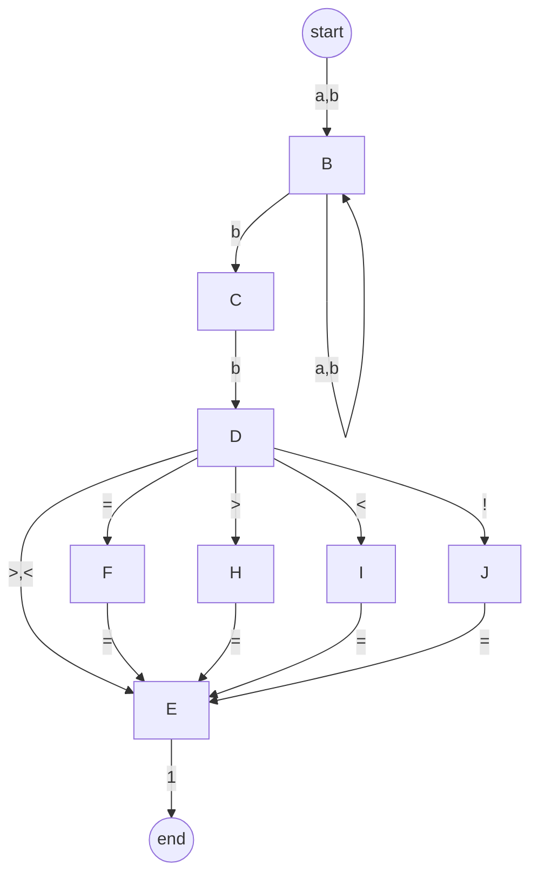

| Attribute | Value |
| --- | --- |
| states | frozenset({1, 2, 3, 4, 5, 6, 7, 8}) |
| input_symbols | frozenset({'a', '>', '=', '<', 'b', '!', '1'}) |
| transitions | frozendict.frozendict({1: frozendict.frozendict({}), 2: frozendict.frozendict({'1': 1}), 3: frozendict.frozendict({'a': 7, 'b': 3, '>': 4, '<': 4, '=': 5, '!': 5}), 4: frozendict.frozendict({'1': 1, '=': 2}), 5: frozendict.frozendict({'=': 2}), 6: frozendict.frozendict({'a': 7, 'b': 3}), 7: frozendict.frozendict({'a': 7, 'b': 6}), 8: frozendict.frozendict({'a': 7, 'b': 7})}) |
| initial_state | 8 |
| final_states | frozenset({1}) |